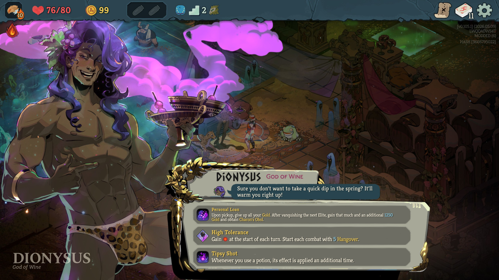
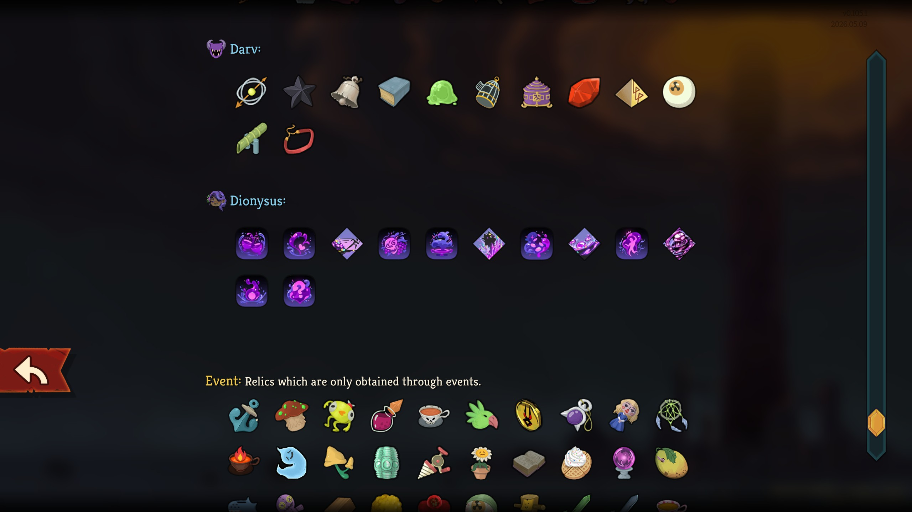

# Dionysus Ancient

## 📄 Description

This mod introduces a new Ancient, **Dionysus** from the hit game Hades 2, who can appear in Act 2 and offers a selection of Relics that focus on 

## 🌐 Localization
The mod is available in:
- English

English and Korean translations would be welcome. Translations for my other mods, Aphrodite and Poseidon, would also be welcome.

## 📦 Dependencies
- BaseLib version 3.1.2 or newer.

## ⚙️ Installation
1. Go to the [Releases](https://github.com/JohnnyBazooka89/StS2ModDionysusAncient/releases) page on GitHub and download the latest version.
2. Extract the ZIP file.
3. Navigate to your *Slay the Spire 2* installation folder: `{SteamLibrary}\steamapps\common\Slay The Spire 2`
4. If the `mods` folder does not exist, create it.
5. Move the `DionysusAncient` folder into the `mods` folder.

## 🖼️ Screenshots

## 🤝 Contact
If you run into any issues or have suggestions for balance changes, feel free to reach out on the official Slay the Spire 2 Discord (nickname: JohnnyBazooka89).